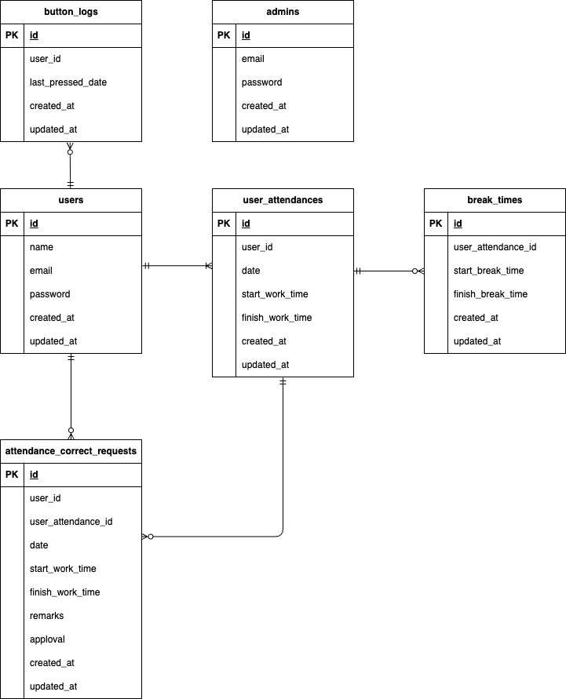

# coachtech 勤怠管理アプリ  

## 概要  

このプロジェクトは社会人全般をターゲットとし、ユーザーの勤怠と管理を目的とするものです  

## 環境構築  

- リポジトリをクローン  
  ```bash
  git clone git@github.com:e-misora/coachtech-Attendance-management.git  
  ```
  ```bash
  cd coachtech-Attendance-management  
  ```
- docker のビルド 起動  
  ```bash
  docker-compose up -d --build  
  ```
- Laravel パッケージのインストール  
  ```bash
  docker-compose exec php bash  
  ```
  ```bash
  composer install  
  ```
- 環境変数を設定  
  ```bash
  cd src  
  ```
  ```bash
  cp .env.example .env  
  ```
  .env ファイルを編集して必要な値を設定  

  ```bash:.env  
  DB_HOST=mysql  
  DB_DATABASE=laravel_db  
  DB_USERNAME=laravel_user  
  DB_PASSWORD=laravel_pass  
  ```

- アプリケーションを実行するためのキーを作成  
  ```bash
  docker-compose exec php bash  
  ```
  ```bash
  php artisan key:generate  
  ```
- マイグレーション,シーディング実行  
  ```bash
  php artisan migrate:refresh --seed  
  ```

## 使用技術（実行環境）  

- php:  
- Laravel:8.83.8  
- MySQL:8.0.26  
- nginx:1.21.1  

## user(ユーザー)のログイン用初期データ  

- email:user@example.com  
- password:user0123  

## admin(管理者)のログイン用初期データ  

- email:admin@example.com  
- password:admin4567  

## URL  

- ユーザーログイン画面: http://localhost/login  
- 管理者ログイン画面: http://localhost/admin/login  
- phpMyAdmin: http://localhost:8080  

## ER図  


